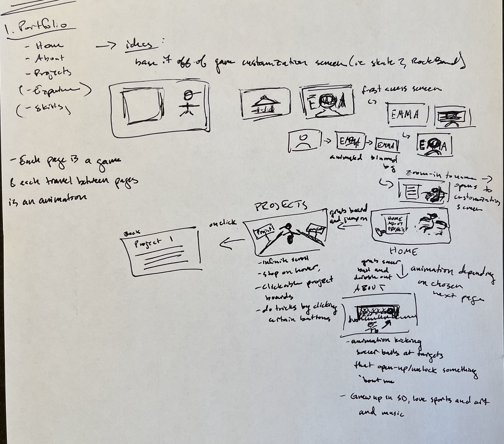
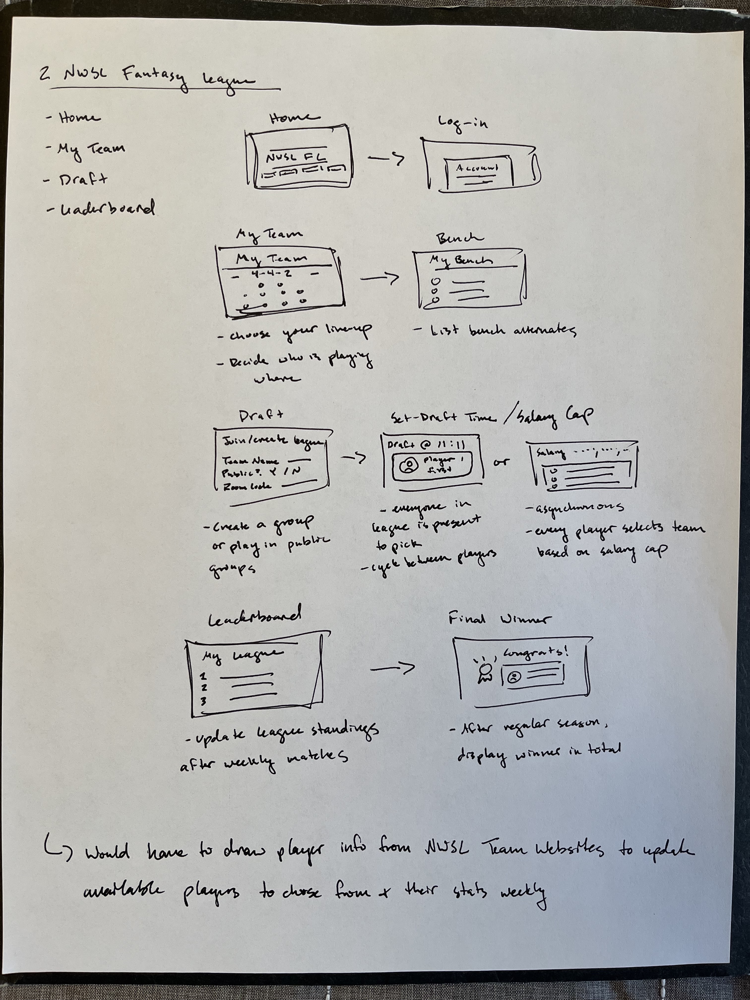
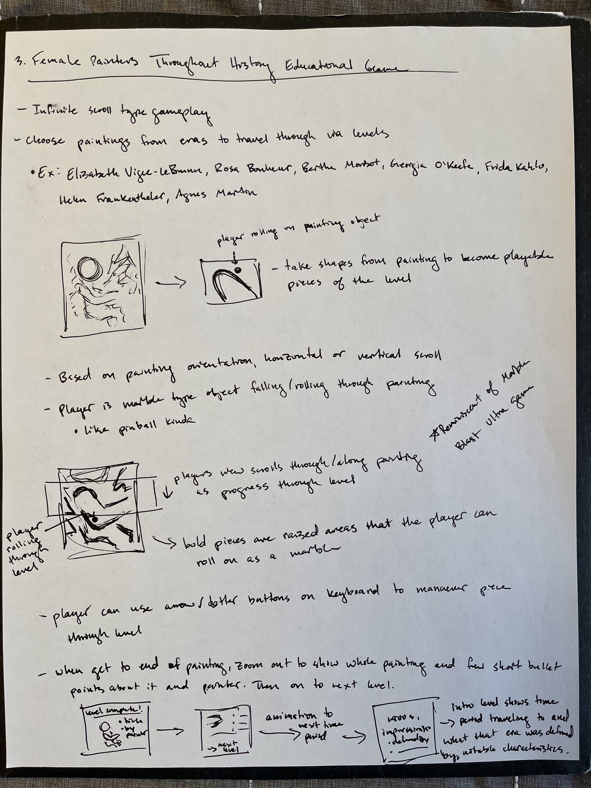

# **FP4 \- Final Project Writeup**

Feel free to refer to this [Markdown Cheat Sheet](https://www.markdownguide.org/cheat-sheet/) to make your writeup more organized, and you can preview your markdown file in VSCode [Markdown editing with Visual Studio Code](https://code.visualstudio.com/docs/languages/markdown#_markdown-preview). 

## Part 1: Website Description

* What is the purpose of your website?   
* Who is the target audience?  
* What information do you convey with your website?   
* How is it interesting and engaging? 

## Part 2: User Interaction

How a user would interact with your website? For each step, briefly but clearly state the interaction type & how we should reproduce it.

1. Interaction type. Click on X on page Y / scroll on page X, etc.  
2. 

## Part 3: External Tool

Describe what important external tool you used (JavaScript library, Web API, animations, or other). Following the bulleted list format below, reply to each of the prompts.

1. Name of tool1  
   * Why did you choose to use it over other alternatives? (2 sentences max)  
   * How you used it? (2 sentences max)  
   * What does it add to your website? (2 sentences max)  
2. Name of tool2

## Part 4: Design Iteration

Describe how you iterated on your prototypes, if at all, including any changes you made to your original design while you were implementing your website and the rationale for the changes. (4-8 sentences max)

## Part 5: Implementation Challenge

What challenges did you experience in implementing your website? (2-4 sentences max)

## Part 6: Generative AI Use and Reflection

Describe how you used Generative AI tools to create this final project (fill in the following information, write \~500 words in total).

Document your use of all GenAI tools — ChatGPT, Copilot, Claude, Cursor, etc. using the template below. Add/Delete rows or bullet points if needed, and replace Tool1/Tool2 with the name of the tool.

### Usage Experiences by Project Aspects

Feel free to edit the column \_ (other?) or add more columns if there's any other aspect in your project you've used the GenAI tools for.

For the following aspects of your project, edit the corresponding table cell to answer:
- *Usage*: Whether you used / did not use this tool for the aspect. Enter [Yes/No]
- *Productivity*: Give a rating on whether this tool makes your productivity for X aspect [1-Much Reduced, 2-Reduced, 3-Slightly Reduced, 4-Not Reduced nor Improved, 5-Slightly Improved, 6-Improved, 7-Much Improved].

| Tool Name | Ratings | design | plan | write code | debug | \_ (other?) |
| :---- | :---- | :---- | :---- | :---- | :---- | :---- |
| Tool1 | Usage | Yes/No | Yes/No | Yes/No | Yes/No | Yes/No |
| Tool1 | Productivity | 1~7 | 1~7 | 1~7 | 1~7 | 1~7 |
| Tool2| Usage | Yes/No | Yes/No | Yes/No | Yes/No | Yes/No |
| Tool2 | Productivity | 1~7 | 1~7 | 1~7 | 1~7 | 1~7 |

### Usage Reflection

> Impact on your design and plan 
* It matched my expectations and plan in [FP2](#generative-ai-use-plan) in that … For example, 
  1. Tool1: 
  2. Tool2:
* It did not match my expectations and plan in [FP2](#generative-ai-use-plan) in that … For example, 
  1. Tool1: 
  2. Tool2:
* GenAI tool did/did not influence my final design and implementation plan because … For example, 
  1. Tool1: 
  2. Tool2:

> Use patterns
* I accepted the generations when …  For example, 
  1. Tool1: this tool once suggested … and I adjusted my design according to the suggestion because … 
  2. Tool2: 
* I critiqued/evaluated the generated suggestions by … For example, 
  1. Tool1: this tool once suggested … but I modified/rejected the suggestion because … 
  2. Tool2: 

> Pros and cons of using GenAI tools
* Pros
  1. Tool1: 
  2. Tool2:
* Cons
  1. Tool1: 
  2. Tool2:

### Usage Log

Document the usage logs (prompts and chat history links) for the GenAI tools you used. Some tools may not have an easy way to share usage logs, just try your best! Some instructions for different tools:

1. [ChatGPT](https://help.openai.com/en/articles/7925741-chatgpt-shared-links-faq) / [Gemini](https://support.google.com/gemini/answer/13743730?hl=en&co=GENIE.Platform%3DDesktop): share the anonymous link to all of your chat histories relevant to this project
2. [GitHub Copilot (VSCode)](https://code.visualstudio.com/docs/copilot/copilot-chat#:~:text=You%20can%20export%20all%20prompts%20and%20responses%20for%20a%20chat%20session%20in%20a%20JSON%20file%20with%20the%20Chat%3A%20Export%20Session...%20command%20(workbench.action.chat.export)%20in%20the%20Command%20Palette.): export chat histories relevant to this project.

---

# **FP3 \- Final Project Check-in**

Document the changes and progress of your project. How have you followed or changed your implementation & GenAI use plan and why? Remember to commit your code to save your progress.

## Implementation Plan Updates

- [ ] ...

## Generative AI Use Plan Updates

- [ ] ...

Remember to keep track of your prompts and usage for [FP4 writeup](#part-6-generative-ai-use-and-reflection).

---

# **FP2 \- Evaluation of the Final project**

## Project Description

Briefly restate your motivation and a short description of your project.

## High-Fi Prototypes

### *Prototype 1*

A brief description and summary of the user feedback (\<100 words, 2 images) 

### *Prototype 2*

…

## Usability Test

Discuss the user feedback you got during the evaluation / usability test (\~300 words). Indicate which feedback you implemented, inspired new directions, or otherwise influenced your final design. 

## Updated Designs

Show screenshots of your updated design based on the user feedback (\<100 words, \~2 images).

## Feedback Summary

Summarize the feedback you received in the lab session and discuss how it influenced your design (\~300 words). 

## Milestones

Outline weekly milestones to plan your expected implementation progress until the end of the semester (\~300 words). 

### *Implementation Plan*

- [ ] Week 9 Oct 28 \- Nov 1:
  - [X] FP1 due
  - [ ] ...
  
- [ ] Week 10 Nov 4 \- Nov 8:   
  - [ ] FP2 due

- [ ] Week 11 Nov 11 \- Nov 15:  
- [ ] Week 12 Nov 18 \- Nov 22:   
- [ ] Week 13 Nov 25 \- Nov 29:  

  - [ ] Thanksgiving  
- [ ] Week 14 Dec 2 \- Dec 6:  
  - [ ] FP4 due 

### *Libraries and Other Components*

List the JS libraries and other components (if applicable) that you plan to use. 
* 

## Generative AI Use Plan

Outline how you plan to use Generative AI tools to aid in the implementation (\~300 words).

### *Tool Use*

 What would you use? Edit the list given your plan. For each tool, explain briefly on what do you expect Generative AI to help you with and what might it not be able to help you with.

* ChatGPT  
  * I will use it for … because it can help me …  
  * I will not use it for … because it might not be able to help me with …   
* GitHub Copilot  
* ...

### *Responsible Use*

How would you use Generative AI responsibly? 

---

# **FP1 \- Proposal for Critique**

## Idea Sketches

### *Idea 1*

My first website idea is a personal portfolio.
The purpose of this wesbite would be to create a fun space to creatively display past projects.
The target audience would be anyone interested in seeing my work but particularly those looking to employ me. As someone looking to get into UX and perhaps the gaming industry or sporting industry, these might be specific employers looking at my potfolio.
I would convey tangibly, my projects, but creatively, my personality. I would want to create a fun and creative interactive website that includes animated transitions and playable mini games on each page. 
The design would be accessible in that it would be designed to work with a screen reader by organizing my website elements thoughtfully.
Growing up, my favorite game by far was Skate 2, I have logged many hours on it, particularly the customization screen as I always loved picking out outfits and setting up my board. Given this, I thought it would be fun to draw inspiration from the Skate 2 player customization screen for my home screen. I envision a little character sitting on a couch and the page selection bar being on the left like in Skate 2. I am not sure yet if I would add anything else to this screen but perhaps some little customization features like switching the hat or t-shirt might be a fun addition. 
When the user clicks on the projects page, an animation of the character getting up and grabbing a skateboard would play, leading the user to the next page. The project page would load with a little scrolling display of the character skating down the street with signs on the road showing projects I have completed. There would be a little playable feature such as the user being able to press a key or click to do a skate trick to emulate the many skating games I played as a kid.
Next, if the user clicked on the about page a similar animation would play but the character would grab a soccer ball instead of a skateboard. The character would head out of the page in a different direction and into the new page containing a soccer goal. This one draws on my past of playing soccer growing up. There could be a little playable target shooting mini game as about me statements displayed on the screen. 

### *Idea 2*

My second website idea would be a Fantasy League for the National Women's Soccer League. 
The purpose of this website would be to encourage excitement and interaction with women's soccer.
The target audience would be sports fans and those interested in the NWSL.
It would be accessible in that images would have alternate descriptions and functionalities would have multiple ways of being accessed such as mouse or keyboard click.
I am a big proponent for women's sports and am a big fan of soccer and the NWSL so as a fan, I think this would be a really fun platform! There would be pages for account creation and forming teams with fellow fantasy leaguers with which everyone would draft their players and compete weekly for the top point scorer based on live league player stats. It would be engaging and interactive in that users would select their team based on current league players and be able to check their scores compared to the other users in their league. There could be a chat feature in which players could message either other with competitve sport banter. 

### *Idea 3*

My third website idea would be an educational game that focused on exhibiting the work of famous female painters and their timeframes. 
The purpose would be to educate users about successful female painters that have been sidelined from history.
The target audience would be anyone since the purpose of this game is to educate people who may have not previously been aware of any female painters. I do not want to only target the niche group of people that are alrady aware of female painters. Since it will be a game, the target audience would be people who are looking to play a marble game and potentially who also like art.
This game would be accessible by allowing the gameplay to be accessed with different functionalities such as the arrowkeys on a desktop or tilt with a mobile device.
Another important topic to me aside from women's sports is women's art. This game would make learning about the work of great female artists through use of a game. The game would draw inspiration from Marble Blast Ultra which is another game that I played a lot as a kid. Certain shapes and lines of the painting will be raised to become playable pieces of the painting. The player would aim to travel either vertically down the length of the painting like pinball or horizontally to the end of the painting. The view of the user would be zoomed into the painting so the full image would not be viewable until the end, leading the user to subconsciously closely inspect the pieces of the painting as they navigate the marble through. Once at the end, the user will see a little summary screen that shows the painting in full, listing the artists name and era and a fact about the piece and artist. Then, the next level would exhibit a new painting.

## Feedback Summary

For my first idea, I received the feedback that the gamification and transitions would allow me the ability to showcase skills in usability and since the core inspiration is coming from Skate 2, it could serve as a design and development guide. Next, for my NWSL Fantasy League idea, I could use preexisting websites such as fantasy leagues for professional men's teams such as the MLB Fantasy League platform as inspiration. I would have to learn how to access pre-loaded meaningful data but this could be a great learning opportunity and a way to challenge myself to learn something new and a little different. Lastly, for my female painter educational game idea, I would need to address the common educational game issue of balancing gamification with educational content. I need to be sure that the gamified elements enhance rather than distract from the educational content.

## Feedback Digestion

I agree with the critiques on my first two projects, being able to use existing platforms as guidance but also allowing enough individuality for me to be creative and offer my own solutions. The portfolio idea would definitely be a challenge in learning how to gamify and make transitions but it would be a challenge in expanding my usability skills so it would definitely be worth while. The NWSL Fantasy League would be challenging in a whole new realm of learning how to draw data from existing sources. In this way, I would broaden my knowledge of using data sources to interact and draw important data out of them to use in my own application. Finally, my last idea raised the most questions in being able to effectively balance education with gaming. I would have to be sure that all of the included gamified aspects would enhance the learning of the paintings. I envision that having the user intricately follow along the lines of the paintings to then be shown what they were moving through was a painting made be a famous female painter, would guide them to attach more personal meaning to the painting since they moved through it virtually. This is something I would need to test as it is only a hypothesis in my mind.