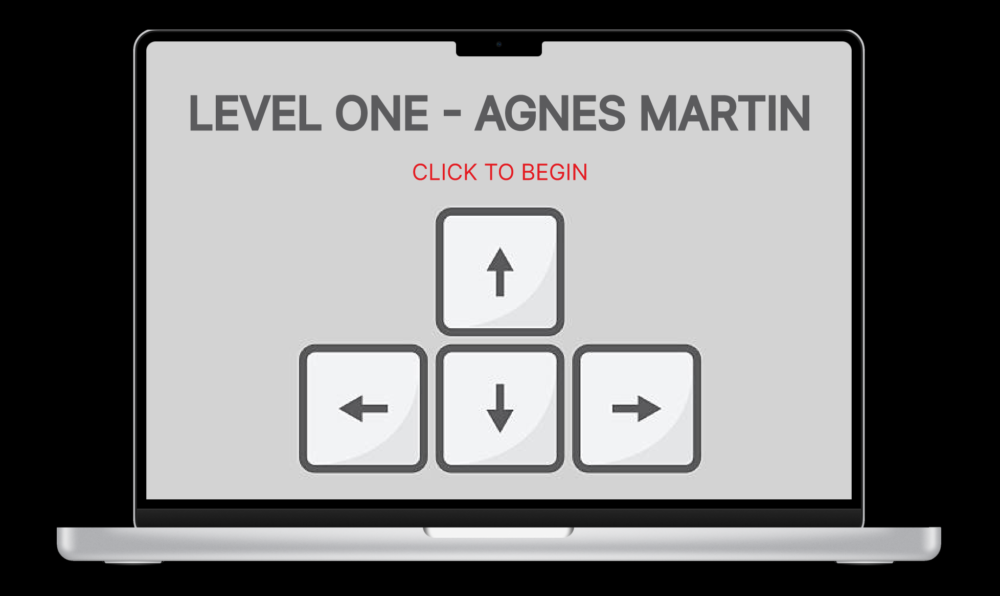
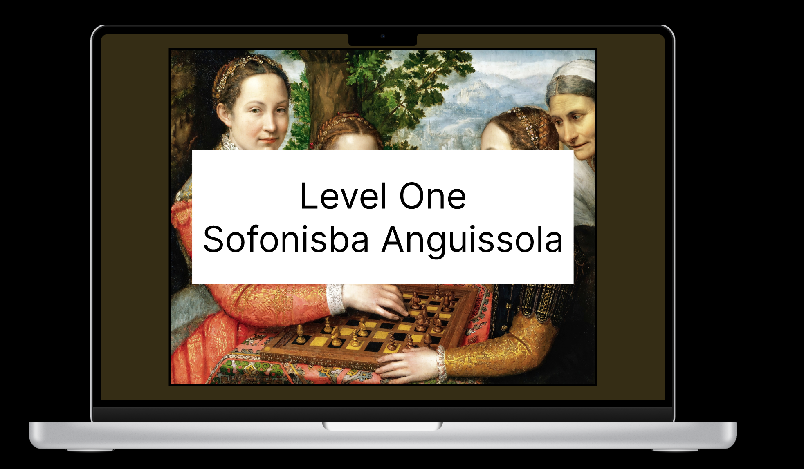
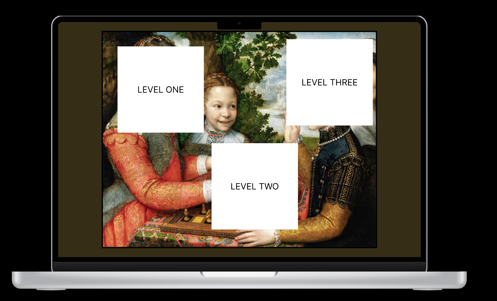

# **FP4 \- Final Project Writeup**

## Part 1: Website Description

* What is the purpose of your website? 
  The purpose of my website is to educate people about female painters in a fun and engaging way.  
* Who is the target audience?  
  I would love for my target audience to be any and all but I understand the niche that I am operating under, so I think the minimum criteria for my target audience would have to be those interested in art history. I did not want to label my game as "female artist" so that the gender label is dropped from art and people can understand it as an educational artist game rather than segregating art from female art. 
* What information do you convey with your website? 
  I convey a brief explanation of the painting once the player has completed all of the levels. Also, visual information is conveyed when the player completes all of the levels and is able to view the painting in full.  
* How is it interesting and engaging? 
  I think using nonogram puzzles to encourage engagement is a unique way to get players interested in learning about art history.

## Part 2: User Interaction

How a user would interact with your website? For each step, briefly but clearly state the interaction type & how we should reproduce it.

1. Player will click on play icon to open the My Gallery page.
2. The player can then choose to either play the tutorial or jump right into unlocking the Sofonisba Anguissola painting. 
3. If they start with the tutorial, they will be able to scroll through the instructions to learn how to play and practice solving the puzzle through clicks.
4. They can return to My Gallery by clicking the button to go back.
5. From My Gallery they can start the Anguissola levels. I did not complete the other painting levels, Elisabeth Vigee LeBrun, and Mary Cassatt but if those were completed, they could choose which painting they would like to explore further.
6. They would click on the level 1 box and be redirected to the puzzle page.
7. Once they complete that puzzle, they will be redirected to the level selection page with which they can continue the same flow for levels 2 and 3.
8. Once they have completed all of the levels, the information describing the painting will be displayed for the player to read. They will have unlocked the painting and click to return back to My Gallery.

## Part 3: External Tool

Describe what important external tool you used (JavaScript library, Web API, animations, or other). Following the bulleted list format below, reply to each of the prompts.

1. P5
   * I specifically chose P5 because it seemed to be a favorite for efficiency. 
   * I used it to draw my canvases. 
   * It is important for the essence of my game, drawing the grids for which the puzzles are built upon. 

## Part 4: Design Iteration

Initially, I had pictured having one puzzle per painting, but after input from user testing that they wanted to feel more engaged with the painting and motivated to interact further with it, I decided to build multiple levels into one painting. I found this to be an effective solution to increase user attachment with the painting and inspire interest in the piece which is great for the educational purposes, however, it meant that my painting selection was limited. I ran out of time to further elaborate my project with the other two paintings but I hope to expand on it further and complete the project in its entirety!

## Part 5: Implementation Challenge

I experienced many challenges in implementing my project. Figuring out how to get the puzzles to work was a priority so thankfully I solved that early on but getting the grid to move to the small square in the level selection took a lot of time, effort, and iterations. Additionally, figuring out how to best create the tutorial took a lot of time. I am happy with the implementation that I settled on, however, getting the styling correct here while not messing with the other pages was a surprisingly huge challenge. 

## Part 6: Generative AI Use and Reflection

Describe how you used Generative AI tools to create this final project (fill in the following information, write \~500 words in total).

Document your use of all GenAI tools — ChatGPT, Copilot, Claude, Cursor, etc. using the template below. Add/Delete rows or bullet points if needed, and replace Tool1/Tool2 with the name of the tool.

### Usage Experiences by Project Aspects

Feel free to edit the column \_ (other?) or add more columns if there's any other aspect in your project you've used the GenAI tools for.

For the following aspects of your project, edit the corresponding table cell to answer:
- *Usage*: Whether you used / did not use this tool for the aspect. Enter [Yes/No]
- *Productivity*: Give a rating on whether this tool makes your productivity for X aspect [1-Much Reduced, 2-Reduced, 3-Slightly Reduced, 4-Not Reduced nor Improved, 5-Slightly Improved, 6-Improved, 7-Much Improved].

| Tool Name | Ratings | design | plan | write code | debug | \_ (other?) |
| :---- | :---- | :---- | :---- | :---- | :---- | :---- |
| ChatGPT | Usage | Yes | No | Yes | Yes 
| ChatGPT | Productivity | 7 | N/A | 7 | 7 | 7 

### Usage Reflection

> Impact on your design and plan 
* It matched my expectations and plan in [FP2](#generative-ai-use-plan) in that … For example, 
  1. ChatGPT: It helped me to figure out how to best code the ideas I had. I did not use it for creativity, but to help my creativity become a reality.
* It did not match my expectations and plan in [FP2](#generative-ai-use-plan) in that … For example, 
  1. ChatGPT: It matched my expectations.
* GenAI tool did/did not influence my final design and implementation plan because … For example, 
  1. ChatGPT: It influenced my design in that it helped me code my ideas but it did not offer me creative changes as I thought up the design myself.

> Use patterns
* I accepted the generations when …  For example, 
  1. ChatGPT: Some of the styling suggestions it gave me were good ideas so I incorporated those into my design. These included button padding and colors. 
* I critiqued/evaluated the generated suggestions by … For example, 
  1. ChatGPT: Some of its solutions were different from its previous suggestions so it resulted in incosistencies, so I did not take these suggestions. For example, it would give me a great way to accomplish level 1 but then a different approach for level 2. I went with the solution that I liked best and implemented that same solution across levels.

> Pros and cons of using GenAI tools
* Pros
  1. ChatGPT: Not being confident in my technical skills, I did not need to limit my ideas to the simple tasks I know how to do without assistance. I was able to imagine bigger and create a product more intriguing to me.
* Cons
  1. ChatGPT: While in the grand scope of thing, it helped me create a more in-depth game, I found myself often times seeking its suggestion for things I would have approached in a different way. Being aware of the different ways of approaching a solution is good when utilizing generative AI technologies.

### Usage Log

Document the usage logs (prompts and chat history links) for the GenAI tools you used. Some tools may not have an easy way to share usage logs, just try your best! Some instructions for different tools:

1. [ChatGPT]https://chatgpt.com/share/6758b529-aff8-8013-829e-3d70c4e99d3d
https://chatgpt.com/share/6758b54a-f368-8013-9272-d48295d5c727
https://chatgpt.com/share/6758b55c-514c-8013-a4a9-9f270527772f
https://chatgpt.com/share/6758b56d-00a8-8013-ab9c-495e91a64f31
https://chatgpt.com/share/6758b591-a188-8013-ab55-8d67c06bbb18
https://chatgpt.com/share/6758b5a2-4d48-8013-ac66-fcc2e0a08e12
https://chatgpt.com/share/6758b5b2-6d0c-8013-9fcc-b23b4651f132

---

# **FP3 \- Final Project Check-in**

Document the changes and progress of your project. How have you followed or changed your implementation & GenAI use plan and why? Remember to commit your code to save your progress.

## Implementation Plan Updates

- [ ] ...

## Generative AI Use Plan Updates

- [ ] ...

Remember to keep track of your prompts and usage for [FP4 writeup](#part-6-generative-ai-use-and-reflection).

---

# **FP2 \- Evaluation of the Final project**

## Project Description

Although I had originally decided to pursue creating my personal portfolio, I reassessed my motivations and interests, weighing the pros and the cons and decided that 
I am  more inspired by my female educational game idea since I am passionate about advocating for the talents of female painters and I would greatly enjoy conducting the
art history research required for this project. I also enjoy the originality of this idea, it feels more unique!

## High-Fi Prototypes

### *Prototype 1*

(images/prototype1-2.png)(images/prototype1-total.png)

A brief description and summary of the user feedback (\<100 words, 2 images) 

Originally I had envisioned a game in which the user traveled as a ball through a painting with the intention of gaining a more intimate
understanding of the painting and thus creating a connection with it. However, after speaking with the people that tested my game, we decided that
more of a PacMan feel would be more entertaining.

### *Prototype 2*

(images/prototype2-2.png)(images/prototype2-total.png)

This is the idea that I am the most excited about. I was inspired by nonograms and decided this would be a fun way to invest interest in learning about paintings.
How it works is the player would traverse through a series of levels inspired by different artistic eras. During each era, a famous female painter of that era will serve
as the representative. A piece from one of their most famous paintings will be missing and have to be completed by the user in a nanogram. Once that nanogram is completed
the user will be able to see the painting in its totality. A brief summary page will highlight the painter, the era, and any interesting facts or observations about the painting.

## Usability Test

My usability tests were very insightful. I found that my original idea of a marble/PacMan game really was not serving to be very effective in sparking interest in the subject matter I was advocating for. 
Thankfully, I found that my other idea, my nanogram idea, turned out to be quite effective and interesting however. Nanograms are an underrated but engaging gameplay that serves to my advantage.
I had a fantastic conversation with one of the usability testers about how to best encourage people to both want to learn about the subject that do not already have interest in it but also how to make sure
that the gameplay is engaging enough and tied closely enough to the subject matter to draw them together and make my project more unique and understandable.
We ended up agreeing that blocking off mutliple pieces of the painting would encourage interest in the game and the painting, making the user curious about the painting in its totality and thus inspiring them to finish all of the levels and move onto the next artwork.
We found that this blocking off of multiple pieces of the painting was more effective than moving onto the next painting after only one level. We deduced that making the user sit longer with the one painting lead to more garnered interest in the painting and the artist
which is the goal!

## Updated Designs

(images/improvedprototype2-2.png)(images/improvedprototype2-total.png)

Show screenshots of your updated design based on the user feedback (\<100 words, \~2 images).

As mentioned above, the newer design includes more levels from the same painting to garner more interest in the painting and artist. Once three levels are completed, the user can move onto the next painting.
At this point they should have a pretty intimate understanding of the first painting having completed three difficult nanogram levels stemming from the same painting. Also, while the user might think they are 
cheating the system in using clues of understanding the shapes of the non-blocked off pieces of the painting for clues, this is great as it promotes the main point of the game, to show interest in viewing and understanding 
the magnificent work of female painters. 

## Feedback Summary

Originally, I had decided to pursue my personal portfolio but I received feedback that was insightful, telling me that I had not intricately thought enough about the user interactions and practical funcionalities of the portfolio.
In going back to answer these questions about what really makes sense for this piece, I found myself coming up empty and feeling uninspired. So, thankfully I revisted my female painter educational game idea and have found that I am now
inspired again! I am very thankful to my lab for pointing out that the gameplay functionality of my portfolio idea was coming across as distracting and unnecessary to the plot of my portfolio as it geared me in the right direction, towards
a project I felt more inspired by at this time.

## Milestones

Weekly, I plan to make significant progress on my game so that I can end up creating a final project that I am proud of. I would like to implement a new functionality weekly whether that be getting down an important gameplay aspect 
such as making the nanogram grids or working on aesthetic animations. I want to be sure to be on top of this so that I can utilize office hours as they are needed and I am not rushing to the deadline. Also, it is very important to me to get
consistent user feedback so I plan to get usability testing feedback weekly. I need to make sure that the ideas in my head are making sense to the users so I must consistently run usabilty testings. 

### *Implementation Plan*

- [ ] Week 9 Oct 28 \- Nov 1:
  - [X] FP1 due
  - [ ] ...
  
- [ ] Week 10 Nov 4 \- Nov 8:   
  - [ ] FP2 due

- [ ] Week 11 Nov 11 \- Nov 15:  Work on creating HTML and CSS
- [ ] Week 12 Nov 18 \- Nov 22:  Work on Javascript functionalities
- [ ] Week 13 Nov 25 \- Nov 29:  Create nice visuals such as animations and look into library capabilities

  - [ ] Thanksgiving  
- [ ] Week 14 Dec 2 \- Dec 6:  Work on incorporating accessibility functionalities.
  - [ ] FP4 due 

### *Libraries and Other Components*

monkeyArms - nanogram library
animation libraries (probably anime.js)
* 

## Generative AI Use Plan

I plan to use Generative AI as a way to help when I run into errors. Firstly, I would like to use my own knowledge learned in this course to build my game. From there, I would also like to do 
my own research on platforms such as github when I run into issues or am looking for inspiration. YouTube is also a really great educational source. Next, Generative AI will be very useful in offering 
direct help about my specifc issues. While I can piece toghether pieces of tutorials and prior knowledge, Generative AI is useful in looking at my direct code to offer quick and effective input right on the spot.

### *Tool Use*

 What would you use? Edit the list given your plan. For each tool, explain briefly on what do you expect Generative AI to help you with and what might it not be able to help you with.

* ChatGPT  
  * I will use it for getting quick and detailed responses for questions specific to my code and project because it can help me by observing my code specifically.
  * I will not use it for copying and pasting solutions because it might not be able to help me with creating the project I am looking to create with my personal vision.  
* ChatGPT is the only Generative AI coding assistant I have used and the only one I plan to use for this project.

### *Responsible Use*

You would use Generative AI responsibily by citing that you used it to help you but also by not just copying and pasting its answers but actually taking the time to read through its detailed step-by-step
explanations for the choices it takes. This is how you learn and can decide if you want to tweak one of the suggestions it is giving you.

# **FP1 \- Proposal for Critique**

## Idea Sketches

### *Idea 1*

My first website idea is a personal portfolio.
The purpose of this wesbite would be to create a fun space to creatively display past projects.
The target audience would be anyone interested in seeing my work but particularly those looking to employ me. As someone looking to get into UX and perhaps the gaming industry or sporting industry, these might be specific employers looking at my potfolio.
I would convey tangibly, my projects, but creatively, my personality. I would want to create a fun and creative interactive website that includes animated transitions and playable mini games on each page. 
The design would be accessible in that it would be designed to work with a screen reader by organizing my website elements thoughtfully.
Growing up, my favorite game by far was Skate 2, I have logged many hours on it, particularly the customization screen as I always loved picking out outfits and setting up my board. Given this, I thought it would be fun to draw inspiration from the Skate 2 player customization screen for my home screen. I envision a little character sitting on a couch and the page selection bar being on the left like in Skate 2. I am not sure yet if I would add anything else to this screen but perhaps some little customization features like switching the hat or t-shirt might be a fun addition. 
When the user clicks on the projects page, an animation of the character getting up and grabbing a skateboard would play, leading the user to the next page. The project page would load with a little scrolling display of the character skating down the street with signs on the road showing projects I have completed. There would be a little playable feature such as the user being able to press a key or click to do a skate trick to emulate the many skating games I played as a kid.
Next, if the user clicked on the about page a similar animation would play but the character would grab a soccer ball instead of a skateboard. The character would head out of the page in a different direction and into the new page containing a soccer goal. This one draws on my past of playing soccer growing up. There could be a little playable target shooting mini game as about me statements displayed on the screen. 

### *Idea 2*

My second website idea would be a Fantasy League for the National Women's Soccer League. 
The purpose of this website would be to encourage excitement and interaction with women's soccer.
The target audience would be sports fans and those interested in the NWSL.
It would be accessible in that images would have alternate descriptions and functionalities would have multiple ways of being accessed such as mouse or keyboard click.
I am a big proponent for women's sports and am a big fan of soccer and the NWSL so as a fan, I think this would be a really fun platform! There would be pages for account creation and forming teams with fellow fantasy leaguers with which everyone would draft their players and compete weekly for the top point scorer based on live league player stats. It would be engaging and interactive in that users would select their team based on current league players and be able to check their scores compared to the other users in their league. There could be a chat feature in which players could message either other with competitve sport banter. 

### *Idea 3*

My third website idea would be an educational game that focused on exhibiting the work of famous female painters and their timeframes. 
The purpose would be to educate users about successful female painters that have been sidelined from history.
The target audience would be anyone since the purpose of this game is to educate people who may have not previously been aware of any female painters. I do not want to only target the niche group of people that are alrady aware of female painters. Since it will be a game, the target audience would be people who are looking to play a marble game and potentially who also like art.
This game would be accessible by allowing the gameplay to be accessed with different functionalities such as the arrowkeys on a desktop or tilt with a mobile device.
Another important topic to me aside from women's sports is women's art. This game would make learning about the work of great female artists through use of a game. The game would draw inspiration from Marble Blast Ultra which is another game that I played a lot as a kid. Certain shapes and lines of the painting will be raised to become playable pieces of the painting. The player would aim to travel either vertically down the length of the painting like pinball or horizontally to the end of the painting. The view of the user would be zoomed into the painting so the full image would not be viewable until the end, leading the user to subconsciously closely inspect the pieces of the painting as they navigate the marble through. Once at the end, the user will see a little summary screen that shows the painting in full, listing the artists name and era and a fact about the piece and artist. Then, the next level would exhibit a new painting.

## Feedback Summary

For my first idea, I received the feedback that the gamification and transitions would allow me the ability to showcase skills in usability and since the core inspiration is coming from Skate 2, it could serve as a design and development guide. Next, for my NWSL Fantasy League idea, I could use preexisting websites such as fantasy leagues for professional men's teams such as the MLB Fantasy League platform as inspiration. I would have to learn how to access pre-loaded meaningful data but this could be a great learning opportunity and a way to challenge myself to learn something new and a little different. Lastly, for my female painter educational game idea, I would need to address the common educational game issue of balancing gamification with educational content. I need to be sure that the gamified elements enhance rather than distract from the educational content.

## Feedback Digestion

I agree with the critiques on my first two projects, being able to use existing platforms as guidance but also allowing enough individuality for me to be creative and offer my own solutions. The portfolio idea would definitely be a challenge in learning how to gamify and make transitions but it would be a challenge in expanding my usability skills so it would definitely be worth while. The NWSL Fantasy League would be challenging in a whole new realm of learning how to draw data from existing sources. In this way, I would broaden my knowledge of using data sources to interact and draw important data out of them to use in my own application. Finally, my last idea raised the most questions in being able to effectively balance education with gaming. I would have to be sure that all of the included gamified aspects would enhance the learning of the paintings. I envision that having the user intricately follow along the lines of the paintings to then be shown what they were moving through was a painting made be a famous female painter, would guide them to attach more personal meaning to the painting since they moved through it virtually. This is something I would need to test as it is only a hypothesis in my mind.